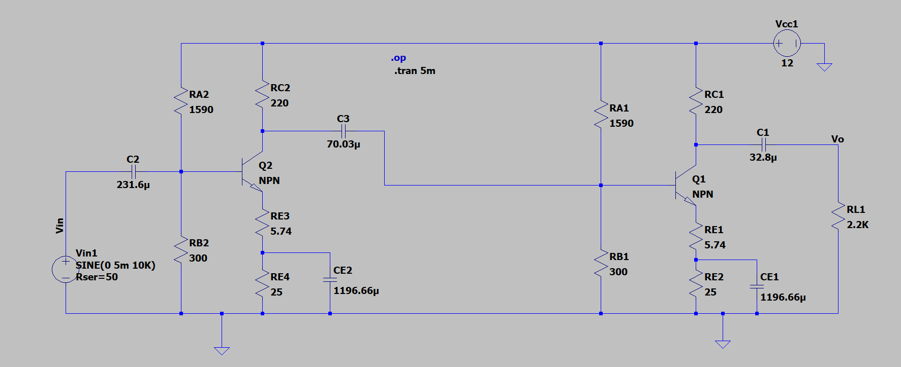
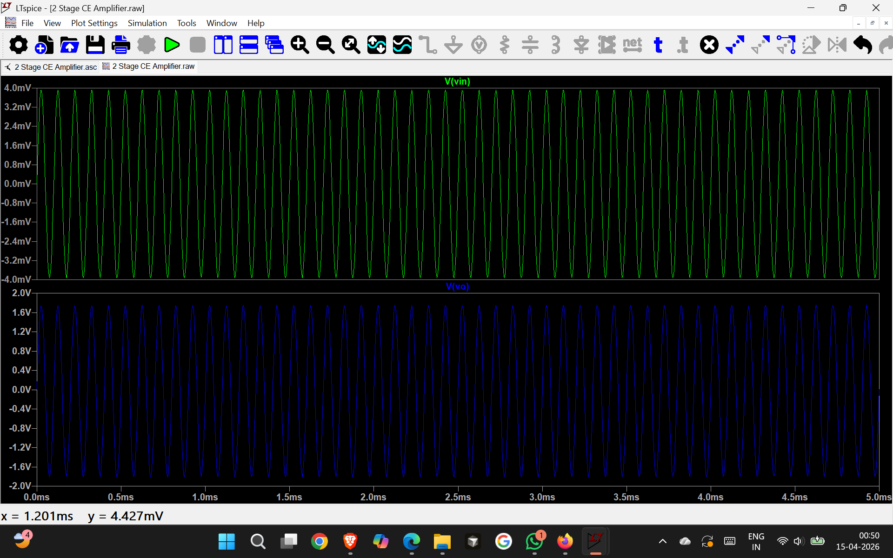

# Two-Stage Common Emitter Amplifier

## Description
This project involves the design and simulation of a two-stage common emitter amplifier using LTspice.

## Tools Used
- LTspice

## Circuit Diagram

## Output Waveform

## Analysis
- AC Analysis
- Transient Analysis

## Results
The amplifier provides increased gain and stable output.

## My Contribution
- Designed the circuit
- Performed simulation
- Analyzed results
